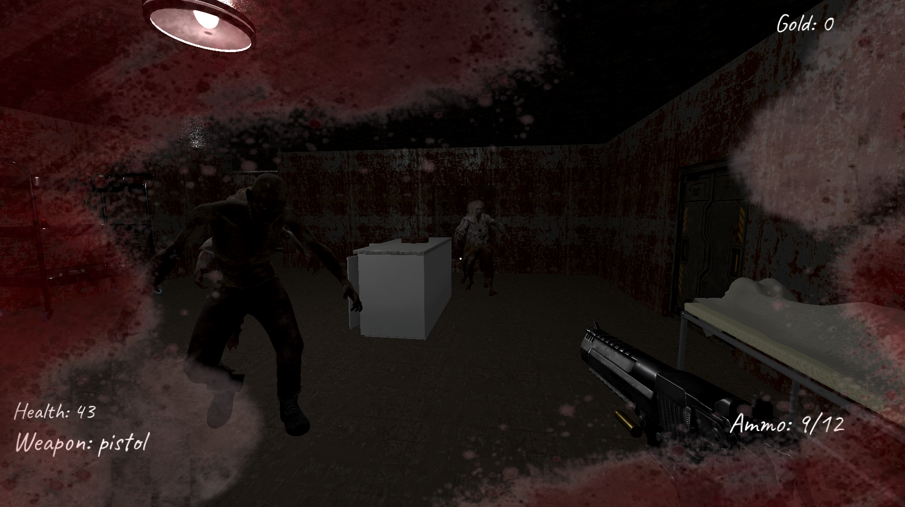

# Station Siege

First-person zombie shooter set on an abandoned space station. You get 10 waves. Survive them and you win the game.

**Play it in your browser: [madyarov27.itch.io/station-siege](https://madyarov27.itch.io/station-siege)**

Nothing to install. Open the link, click Start, and click inside the game window to lock the mouse. Works best in Chrome or Edge on a desktop.

## Controls

| Key | Action |
|---|---|
| W A S D | Move |
| Shift | Sprint |
| Left click | Shoot |
| R | Reload |
| 1, 2, 3 | Switch weapon |
| E | Interact, buy from shops, read notes |
| Hold F | Repair a barricade |
| Esc | Pause |

Click once inside the game window and it grabs your mouse.

## What's in it

- 10 waves, and each one sends more zombies than the last.
- Three weapons: pistol, shotgun and machine gun. You start with the pistol and buy the other two from vending machines.
- Kill zombies for gold, then spend it at the vending machines on weapons, ammo and doors to new parts of the station.
- Zombies come out of spawn rooms blocked by barricades. They tear the boards off, and you can nail them back on for a bit of gold.
- There's a note near where you spawn that explains what happened here.

## Running it yourself

You need [Godot 4.7](https://godotengine.org/download). Clone the repo, open `project.godot` in Godot and press F5.

The first time you open it Godot has to import all the models and textures, so give it a few minutes.

## Some notes on how it works

Zombies use Godot's navigation mesh to find you. Barricades and doors are left out of the navmesh on purpose. Early on they were baked in, so a doorway stayed "blocked" for pathfinding even after you opened the door or the boards were gone, and zombies would pile up there forever. Now the navmesh treats those spots as open floor, and the zombie script decides when to stop and attack a barricade. As a backup, a zombie that makes no real progress for 20 seconds despawns so it can't hold up the next wave.

The machine gun plays its shot sound through a small pool of audio players instead of one, so fast shots don't cut each other off.

The web build was tricky. The first export was 2.3 GB and wouldn't load in a browser at all. Most of that was unused models, so I cut those out of the export. GPU texture compression also looked fine on desktop but came out garbled in WebGL, so the web build uses lossy WebP textures capped at 2048px instead. That got the game package down to about 140 MB, which also fits under itch.io's 200 MB per-file limit.

## Putting the web build on itch.io

1. In Godot go to Project > Export, pick the **Web** preset and export into an empty folder.
2. Rename `station-siege.html` to `index.html`. itch.io looks for that name.
3. Zip everything in that folder. The files need to be at the top of the zip, not inside another folder.
4. On itch.io set the project type to HTML and upload the zip. Tick "This file will be played in the browser".
5. Under Embed options set the size to 1200 x 600 and tick **SharedArrayBuffer support**. The build uses threads, so it won't start without that.
6. Open the itch page and play it once to make sure it loads.

## Credits

- 3D models: Sketchfab, and a few from Tripo.
- Character animations: Mixamo.
- Sound effects: various free SFX libraries.

<!-- TODO: double-check each asset's license allows redistribution before publishing -->
